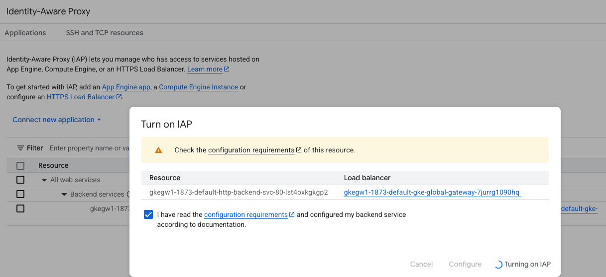

# GKE with IAP

## Overview

This project sets up a Google Cloud GKE Cluster with a Gateway Controller and an IAP-protected backend service.

[Enabling IAP for GKE Gateway Controller](https://cloud.google.com/kubernetes-engine/docs/how-to/configure-gateway-resources#configure_iap)
[Secure a Gateway](https://docs.cloud.google.com/kubernetes-engine/docs/how-to/secure-gateway)
[GatewayClass Support for IAP](https://cloud.google.com/kubernetes-engine/docs/how-to/gatewayclass-capabilities#additional-services)

## Google Disclaimer
This is not an officially supported Google product

## Setup Environment
```bash
#Setup Environment variables
export ORGANIZATION_ID= #e.g. 123456789876
export PROJECT_NAME= #e.g. gke-iap
export REGION= #e.g. us-central1
export BILLING_ACCOUNT= #e.g. 111111-222222-333333
export GKE_CLUSTER= #e.g. gke-iap
export REGION= #e.g. us-central1
export ZONE= #e.g. us-central1-c
export NETWORK_NAME= #e.g. demo-network
export SUBNET_RANGE= #e.g. 10.128.0.0/20 
export FQDN= #e.g. test.example.com
export WORKFORCE_POOL_NAME= #Optional: e.g. locations/global/workforcePools/okta-workforce-pool

#Create Project
gcloud config unset project
gcloud config unset billing/quota_project
printf 'Y' | gcloud projects create --name=$PROJECT_NAME --organization=$ORGANIZATION_ID
while [ -z "$PROJECT_ID" ]; do
  export PROJECT_ID=$(gcloud projects list --filter=name:$PROJECT_NAME --format 'value(PROJECT_ID)')
done
export PROJECT_NUMBER=$(gcloud projects list --filter=id:$PROJECT_ID --format 'value(PROJECT_NUMBER)')
printf 'y' |  gcloud beta billing projects link $PROJECT_ID --billing-account=$BILLING_ACCOUNT

gcloud config set project $PROJECT_ID
printf 'Y' | gcloud config set compute/region $REGION
gcloud config set billing/quota_project $PROJECT_ID

#Enable APIs
printf 'y' |  gcloud services enable compute.googleapis.com --project $PROJECT_ID
printf 'y' |  gcloud services enable container.googleapis.com --project $PROJECT_ID
printf 'y' |  gcloud services enable gkehub.googleapis.com --project $PROJECT_ID
printf 'y' |  gcloud services enable cloudresourcemanager.googleapis.com --project $PROJECT_ID
printf 'y' |  gcloud services enable cloudbuild.googleapis.com --project $PROJECT_ID

gcloud auth application-default set-quota-project $PROJECT_ID
```

## Setup Network
```bash
#Setup Network
gcloud compute networks create $NETWORK_NAME \
    --project=$PROJECT_ID \
    --subnet-mode=custom 
gcloud compute networks subnets create $NETWORK_NAME-subnet \
    --project=$PROJECT_ID \
    --network=$NETWORK_NAME \
    --range=$SUBNET_RANGE \
    --region=$REGION

#Setup NAT
gcloud compute routers create nat-router \
  --project=$PROJECT_ID \
  --network $NETWORK_NAME \
  --region $REGION
gcloud compute routers nats create nat-config \
  --router-region $REGION \
  --project=$PROJECT_ID \
  --router nat-router \
  --nat-all-subnet-ip-ranges \
  --auto-allocate-nat-external-ips
  ```

## Setup GKE
```bash
gcloud container clusters create-auto $GKE_CLUSTER \
  --region=$REGION \
  --project=$PROJECT_ID \
  --enable-private-nodes \
  --network=$NETWORK_NAME \
  --subnetwork=$NETWORK_NAME-subnet \
  --master-ipv4-cidr "172.16.1.0/28" \
  --enable-dns-access \
  --enable-fleet \
  --enable-secret-manager \
  --security-posture=enterprise \
  --workload-vulnerability-scanning=enterprise

MY_IPV4=$(curl -s ipinfo.io/ip)
gcloud container clusters update $GKE_CLUSTER \
  --project=$PROJECT_ID \
  --enable-master-authorized-networks \
  --master-authorized-networks $MY_IPV4/32 \
  --region $REGION

gcloud container clusters get-credentials $GKE_CLUSTER \
  --region $REGION \
  --project $PROJECT_ID \
  --dns-endpoint
```

## Build Container
```bash
## Setup Artifact Registry
gcloud artifacts repositories create example-repo \
  --project=$PROJECT_ID \
  --repository-format=docker \
  --location=$REGION \
  --allow-vulnerability-scanning \
  --description="GKE Quickstart Sample App"

gcloud projects add-iam-policy-binding $PROJECT_ID \
  --member "serviceAccount:$PROJECT_NUMBER-compute@developer.gserviceaccount.com" \
  --role "roles/storage.admin"

gcloud projects add-iam-policy-binding $PROJECT_ID \
  --member "serviceAccount:$PROJECT_NUMBER-compute@developer.gserviceaccount.com" \
    --role="roles/logging.logWriter"

gcloud projects add-iam-policy-binding $PROJECT_ID \
  --member "serviceAccount:$PROJECT_NUMBER-compute@developer.gserviceaccount.com" \
    --role="roles/artifactregistry.writer"

gcloud builds submit \
  --region=$REGION \
  --tag $REGION-docker.pkg.dev/$PROJECT_ID/example-repo/hello-world:latest
```

## Create Certificate
```bash
gcloud compute ssl-certificates create gkeiap-cert \
    --domains=$FQDN \
    --project=$PROJECT_ID \
    --global
```

## Deploy Gateway and Application
```bash
export IMAGE_REFERENCE=$REGION-docker.pkg.dev/$PROJECT_ID/example-repo/hello-world:latest
sed -i '' "s#\[IMAGE_REFERENCE\]#${IMAGE_REFERENCE}#g" deployment.yaml

kubectl apply -f ./deployment.yaml
```

## Optional: Manually Enable IAP


## Optional: Enable IAP with Workforce Identity Authentication
```bash
# OAuth Configuration
OAUTH_CLIENT_NAME=iap-workforce-client
OAUTH_CLIENT_CREDENTIAL_NAME=iap-workforce-credential
gcloud iam oauth-clients create $OAUTH_CLIENT_NAME \
    --project=$PROJECT_ID \
    --location=global \
    --client-type="CONFIDENTIAL_CLIENT" \
    --display-name="OAuth for Workforce Identity" \
    --description="OAuth for Workforce Identity" \
    --allowed-scopes="https://www.googleapis.com/auth/cloud-platform" \
    --allowed-redirect-uris="https://temp.com" \
    --allowed-grant-types="authorization_code_grant"

OAUTH_CLIENT_ID=$(gcloud iam oauth-clients describe $OAUTH_CLIENT_NAME \
    --project $PROJECT_ID \
    --format 'value(clientId)' \
    --location global)

gcloud iam oauth-clients update $OAUTH_CLIENT_NAME \
    --project=$PROJECT_ID \
    --location=global \
    --allowed-redirect-uris="https://iap.googleapis.com/v1/oauth/clientIds/$OAUTH_CLIENT_ID:handleRedirect"

gcloud iam oauth-clients credentials create $OAUTH_CLIENT_CREDENTIAL_NAME \
    --oauth-client=$OAUTH_CLIENT_NAME \
    --project=$PROJECT_ID \
    --display-name='IAP Workforce Credential' \
    --location='global'

OAUTH_CLIENT_SECRET=$(gcloud iam oauth-clients credentials describe $OAUTH_CLIENT_CREDENTIAL_NAME \
    --oauth-client=$OAUTH_CLIENT_NAME \
    --project=$PROJECT_ID \
    --format 'value(clientSecret)' \
    --location='global')

#IAP Configuration
printf 'y' |  gcloud services enable iap.googleapis.com --project=$PROJECT_ID

cat <<EOF > iap_settings.yaml
access_settings:
  identity_sources: ["WORKFORCE_IDENTITY_FEDERATION"]
  workforce_identity_settings:
    workforce_pools: ["$WORKFORCE_POOL_NAME"]
    oauth2:
      client_id: "$OAUTH_CLIENT_ID"
      client_secret: "$OAUTH_CLIENT_SECRET"
EOF

gcloud iap settings set iap_settings.yaml \
  --project=$PROJECT_ID \
  --resource-type=iap_web

#Grants Access to All Identities in Pool
gcloud iap web add-iam-policy-binding \
    --member=principalSet://iam.googleapis.com/$WORKFORCE_POOL_NAME/* \
    --role='roles/iap.httpsResourceAccessor' \
    --project=$PROJECT_ID
```

## Clean Up
```bash
kubectl delete -f ./deployment.yaml
```